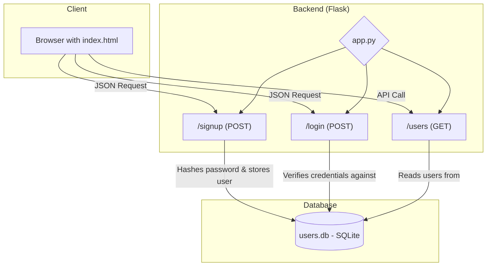

# Simple Flask Authentication API

## Project Aim
This project is a straightforward backend service that provides fundamental user authentication functionalities. It includes user signup and login, using a secure password hashing mechanism and a lightweight database, making it an excellent template for learning or starting a new web application.

## Technical Implementation
The backend is built with Python using the **Flask** web framework. It connects to a simple **SQLite** database (`users.db`) to persist user data. For security, passwords are not stored in plaintext; instead, they are hashed and verified using the `werkzeug.security` library. The API has Cross-Origin Resource Sharing (CORS) enabled, allowing it to be called from a separate frontend application.

The project also includes a basic `index.html` file to serve as a frontend for interacting with the API.

## Key Features
- **User Signup:** An endpoint to register new users with a name, email, and password.
- **Secure Login:** An endpoint to authenticate users by comparing a password to its stored hash.
- **Password Hashing:** Implements `generate_password_hash` and `check_password_hash` for secure credential management.
- **SQLite Database:** Uses a file-based SQLite database for simple and serverless data storage.

## Setup Instructions
- **Install dependencies:** `pip install Flask Flask-Cors Werkzeug`
- **Run the server:** `python app.py`

## System Diagram

